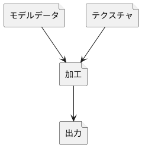

# 描画エンジン初回説明

---

この資料は **UNITXX.pdf** の補助教材として説明を行っています。単体では意味がありませんので必ず **UNITXX.pdf** と一緒に進めてください。

XX には番号が入ります。0 から順に進めてください。

別途、参考資料として **UNITXX.pptx** も併せて確認することで効果が上がるのでそちらも確認して進めてみてください。

**UNITXX_LEARNING** は **UNITXX.pdf** の **学習要項** の部分の説明をしています。
**UNITXX_EXERCISE** は **UNITXX.pdf** の **演習手順** の部分の解説をしています。

**UNITXX.pdf** の**学習要項**を確認し、 **UNITXX_LEARNING** を一通り呼んだあと **UNITXX.pdf** の**演習手順**を参考資料の **UNITXX.pptx** を見ながら進めていき、わからなくなったら **UNITXX_EXERCISE** を見て進めて見てください。

---

ゲームを作る際には「描画」「入力」「サウンド」「企画」「サーバ」などなどいろいろな役割があります。

DirectX で出来る事はそのなかの描画部分になります。この部分は「ゲームを作る」というよりは、ゲームを作るための手助けをするという「システム班」や「ツール班」側のプログラムになります。

@import "images/01.png"

---

## 描画エンジン開発I・IIで学習すること

##### ◇２Ｄスプライトや３Ｄモデルを表示するための​グラフィックスパイプラインを理解する。

##### ◇画像ファイルや３Ｄモデル(obj)ファイルの読み込みや表示までの​一連の流れを実習する。

##### ◇DirectX11を使って自作の描画ライブラリを作ります。​→いろいろ改造して就職作品制作に使えるようにしよう。

---

### グラフィックスパイプライン とは

**グラフィックスパイプライン**とは何かを軽く説明します。

**グラフィックスパイプライン**、または、**描画パイプライン**、または、**レンダリングパイプライン**、とはモデルデータの入力から出力までの描画の為の加工手順の事です。

そしてこの一連の流れである、３Ｄモデルのポリゴンデータやテクスチャデータを使用して画面や画像として出力する事を**レンダリング**(**描画**)と呼びます。

描画パイプラインを理解し**2Dの表示**や**3Dのモデル**を加工し、表示できるようなフレームワークを作れるようになることがこの授業の目的となります。

---

現在の就職作品の基準として「描画エンジンを使用した自作フレームワークでのゲーム作品」というのが企業は求めており、代表的な描画エンジンである**DirectX**での開発はとても重要であると考えて欲しいのです。

もちろん企業に就職した後も**DirectX**を扱えるという事はそれだけ携われる作品が増えるという事でもあります。