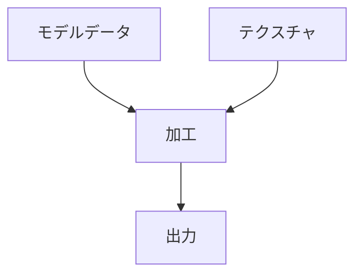
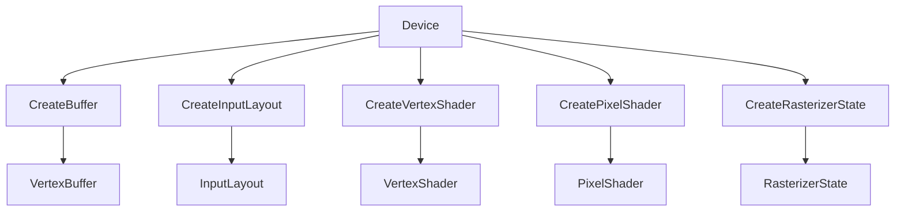
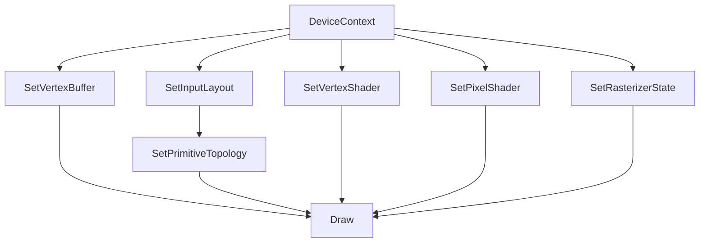

<!--
    UNIT02 SPRITE 学習要項.md

    <div style="text-align: center;"></div>

    <span style="color:#994433;border: 1px red solid; padding: 2px;font-size:100%;font-weight: bold;"></span>

    <a href="https://github.com/KhronosGroup/Vulkan-ValidationLayers" class="Link--external">オープンソース</a>

    * [検証レイヤーとは](#01_)
    ## <span style="color:#334488;">検証レイヤーとは</span><a name="01_"></a>
-->

# <div style="text-align: center;"><span style="color:#334499; font-size:100%; font-weight: bold; ">UNIT02 SPRITE 学習要項</span></div>

* 目次
    * [Rendering pipeline](#01_)
    * [Vertex buffers](#02_)
    * [NDC(Normalized Device Coordinates)](#03_)
    * [Primitive topology](#04_)
    * [Vertices and Input layouts](#05_)
    * [HLSL](#06_)
    * [Semantics](#07_)
    * [Vertex Shader](#08_)
    * [Pixel Shader](#09_)
    * [Textures and Data Resource Formats](#10_)

---

## <div style="text-align: center;"><span style="color:#334499; font-size:100%; font-weight: bold; ">Rendering pipeline</span></div><a name="01_"></a>

**グラフィックスパイプライン**、または、**描画パイプライン**、または、**レンダリングパイプライン**、とはモデルデータの入力から出力までの描画の為の加工手順の事です。



そしてこの一連の流れである、３Ｄモデルのポリゴンデータやテクスチャデータを使用して画面や画像として出力する事を**レンダリング**(**描画**)と呼びます。

@import "images/描画パイプライン.png"

つまり今回は**デバイスコンテキスト**から **Draw** を呼び出すために必要な手続きを行っていくのが目的となります。

---

#### <span style="color:#334488;">ポリゴンとは？</span>

**ポリゴン**とは３つ以上の頂点で形成される多角形のこと。

ポリゴンデータとは3Dモデルのデータの事で、ポリゴンの集合です。モデルデータで使用するポリゴンの頂点数は三または四頂点で構成されていることが多いです。

このポリゴンの頂点情報(座標や色など)を管理するためのバッファのことを<span style="color:#992211;font-weight: bold;">頂点バッファ</span>と呼びます。

@import "images/ポリゴンと頂点バッファ.png"

---

#### <span style="color:#334488;">テクスチャとは？</span>

テクスチャとは物体の表面の質感を表現するために、3Dオブジェクトの表面に貼り付ける模様や画像の事を指します。
実際にはそれらを 赤 緑 青 透明度 の値などで表現します。

---

#### <span style="color:#334488;">スプライトとは？</span>

複数の画像や図形を合成して表示する技術の事をスプライトと呼びます。

---

描画パイプラインからポリゴンを描画するには GPU に以下の５つを渡す必要があります。

##### <span style="color:#222299;">◇頂点データ</span>
##### 座標、色などのポリゴンを構成するために必要な情報

##### <span style="color:#222299;">◇入力レイアウト</span>
##### 頂点データにどのような情報があるか定義し、シェーダーに教えるやつ

##### <span style="color:#222299;">◇頂点シェーダー</span>
##### 頂点データを受け取ってスクリーン座標に変換する計算をする

##### <span style="color:#222299;">◇ピクセルシェーダー</span>
##### ポリゴンの色をピクセル単位で計算する

##### <span style="color:#222299;">◇描画ステート</span>
##### ポリゴンの表示方法や奥行比較方法などの様々な設定をする​<br>今回はラスタライザステートを設定する

これらをデバイスを使って作成します。





作成したらデバイスコンテキストを介して GPU に渡します。



---

## <div style="text-align: center;"><span style="color:#334499; font-size:100%; font-weight: bold; ">Vertex buffers</span></div><a name="02_"></a>

#### <span style="color:#334488;">頂点バッファ</span>

頂点データを GPU で扱うための格納用のバッファ。

    ID3D11Buffer

GPU に渡された頂点データは**頂点シェーダー**で頂点を加工するために使います。頂点位置を**NDC**座標に変換したり、ライティング計算したりします。

---


## <div style="text-align: center;"><span style="color:#334499; font-size:100%; font-weight: bold; ">NDC(Normalized Device Coordinates)</span></div><a name="03_"></a>

ポリゴンの座標として設定される頂点データ。
この頂点データに設定する頂点位置はスクリーン座標系ではない事に注意。
1280x720ではないという事。

頂点データに設定する頂点位置は**NDC**を使います。

@import "images/NDC.png"

この座標系を元にポリゴンの頂点位置を設定致します。
こうすることで、ウィンドウのサイズが変わっても比率を維持した状態で表示することが可能になります。

---

## <div style="text-align: center;"><span style="color:#334499; font-size:100%; font-weight: bold; ">Primitive topology</span></div><a name="04_"></a>


#### <span style="color:#334488;">プリミティブトポロジー</span>

頂点データに位置と色を設定する際に下記のような単純な構造体を作成します。

```cpp
// 頂点フォーマット
struct vertex
{
    DirectX::XMFLOAT3 position;
    DirectX::XMFLOAT4 color;
};
```

これが１つのポリゴンの１個の頂点の情報であり、この構造体の事を頂点フォーマットと呼びます。
この構造体に対してポリゴンの情報を作る際、以下のように値を設定いたします。

```cpp
// 頂点データ
vertex vertices[]
{
    { { -0.5, +0.5, 0 }, { 1, 1, 1, 1 } },
    { { +0.5, +0.5, 0 }, { 1, 0, 0, 1 } },
    { { -0.5, -0.5, 0 }, { 0, 1, 0, 1 } },
    { { +0.5, -0.5, 0 }, { 0, 0, 1, 1 } },
};
```

これが頂点データであり、「複数のポリゴンの情報」になります。

この頂点を１つ１つを結んで三角形を形作ることでポリゴンが出来ます。

三角形を１つ作るだけなら頂点位置を３つ用意すれば良いのですが、２つ以上作る場合どうすれば良いのでしょうか？

頂点位置６個用意するのか？
    
    ６個用意する理由はなぜ？
    単純に三角形を２つで四角形を作りたいから。
    三角形を離して表示したいから！

頂点位置４個を使いまわすのか？

    ４個で使いまわす理由はなぜ？
    頂点がいっぱいあるから頂点データを節約したい！
    三角形が隣り合っている。

というように、頂点をどのように結んでいくのかを設定する項目が**プリミティブトポロジー**です。

@import "images/プリミティブトポロジー.png"

---

## <div style="text-align: center;"><span style="color:#334499; font-size:100%; font-weight: bold; ">Vertices and Input layouts</span></div><a name="05_"></a>

#### <span style="color:#334488;">入力レイアウト</span>

頂点データとして設定した下記の情報を描画するために GPU 側へと送るのですが、
```
{ -0.5, +0.5, 0 }, { 1, 1, 1, 1 }
{ +0.5, +0.5, 0 }, { 1, 0, 0, 1 }
{ -0.5, -0.5, 0 }, { 0, 1, 0, 1 }
{ +0.5, -0.5, 0 }, { 0, 0, 1, 1 }
```

GPU は単にこれを送っても **XMFLOAT3** と **XMFLOAT4** と認識してもらえません。
GPU 側では
    
    -0.5, +0.5, 0, 1, 1, 1, 1, +0.5, +0.5, 0, 1, 0, 0, 1 -0.5, -0.5, 0, 0, 1, 0, 1, +0.5, -0.5, ...

といった敷居のない単なる数値の羅列として認識されエラーとなります。
そこで、GPU に対してこの数値の羅列が、どのようなデータで、どこに敷居があり、その敷居をどのように呼ぶか、などなどの詳細情報を設定する項目を定めました。
それを入力レイアウトと呼びます

    ID3D11InputLayout

---

## <div style="text-align: center;"><span style="color:#334499; font-size:100%; font-weight: bold; ">HLSL</span></div><a name="06_"></a>


HLSLとは、**High Level Shader Language (高レベルシェーディング言語)** の事で**DirectX**による3Dプログラミングで、Cに似た言語で書かれた 外部ファイル(.hlsl .hlsli)を組み込む事で、頂点やピクセルの出力結果を、自由に、高速にカスタマイズできます。

HLSL ファイルは VisualStudio 側でコーディングしコンパイルすることで .cso ファイルを生成します。この .cso をファイルに記載された文字列を GPU 側に読み込ませ実行させることでシェーダーを処理させることができます。

**デバイスコンテキスト**の**Draw**を呼び出すとGPUは下記の順に処理を行います。

@import "images/シェーダ.png"

シェーダプログラムも C や C++ と同様に関数を作成してそこに必要な処理を書きます。

||
--|--
|書式

```
戻り値の型 関数名( 引数 )
{
}
```

---

## <div style="text-align: center;"><span style="color:#334499; font-size:100%; font-weight: bold; ">Semantics</span></div><a name="07_"></a>

#### <span style="color:#334488;">セマンティクス</span>

HLSL の関数の引数には入力用引数と出力用引数があります。

||
--|--
|入力用引数書式
```
型 変数名 : 入力セマンティクス
```

```
float3 pos : POSITION
```

||
--|--
|出力用引数書式
```
out 型変数名 : 出力セマンティクス
```
```
out float4 out_pos : POSTION
```


GPU の引数には変数に対してどんなデータが入っているかを設定する必要があり、それを設定するのがセマンティクスです。セマンティクスは頂点シェーダ、ピクセルシェーダなどのシェーダ毎に入力、出力の情報が決められており、それらの情報を引数として設定します。

今回頂点シェーダーとピクセルシェーダーの両方のファイルで同じ構造体を利用しています。
下記のような位置と色を持った構造体です。

    sprite.hlsli

```hlsl
struct VS_OUT
{
    float4 position : SV_POSITION;
    float4 color : COLOR;
}
```

float4 は４つの値を扱えるベクトル(x, y, z, w または r, g, b, a)です。

position color ともに float4 ではあるが、この float4 がどのような用途に利用される値であるかを GPU 側に説明する必要があり、その説明の事をセマンティクスと呼びます。

ここでは位置と色に利用するので

    SV_POSITION

と

    COLOR

を指定しています。

セマンティクス自体は決まったものが用意されているのでその中から選んで設定します。

---

## <div style="text-align: center;"><span style="color:#334499; font-size:100%; font-weight: bold; ">Vertex shader</span></div><a name="08_"></a>


GPU で頂点データの加工処理を行います。

頂点座標の **NDC** から**スクリーン座標**への座標変換やライティング計算などを行い、計算結果をピクセルシェーダに渡します。

下記は頂点シェーダーのコードの一例です。

    sprite_vs.hlsl

```hlsl
#include "sprite.hlsli" 
VS_OUT main(float4 position : POSITION float4 color : COLOR)
{
    VS_OUT vout;
    vout.position = position;
    vout.color = color;
    return vout;
} 
```

---

## <div style="text-align: center;"><span style="color:#334499; font-size:100%; font-weight: bold; ">Pixel shader</span></div><a name="09_"></a>


頂点シェーダーで計算されラスタライズされた１つ１つのピクセルに表示する色を決定する。テクスチャの色を取り出して加工したりもする。

下記はピクセルシェーダーのコードの一例です。

    sprite_ps.hlsl

```hlsl
#include "sprite.hlsli"
float4 main(VS_OUT pin) : SV_TARGET
{
    return pin.color;
} 
```

---

## <div style="text-align: center;"><span style="color:#334499; font-size:100%; font-weight: bold; ">Textures and Data Resource Formats</span></div><a name="10_"></a>

#### テクスチャ（ID3D11Texture2D）

テクスチャとは物体の表面の質感を表現するために、3Dオブジェクトの表面に貼り付ける模様や画像の事を指します。
実際にはそれらを 赤 緑 青 透明度 の値などで表現します。

---

#### フォーマット（DXGI_FORMAT）

テクスチャが扱うことのできる色データの事を指します。

種類については<a href="https://fenix-pc.blog.jp/archives/16718649.html?ref=head_btn_next&id=8136202#gsc.tab=0" class="Link--external">ここのサイト</a>を参考にしてください。
